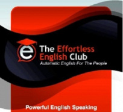

Phương pháp học Tiếng Anh hiệu quả nhất – Phần 1
================================================

Bắt đầu từ bài này trở đi Doremon sẽ mổ xẻ một cách chi tiết vấn đề, và các
vấn đề này sẽ xoáy sâu vào những nội dung sau:

1.  Cung cấp tài liệu và phương pháp để các bạn đạt được mục tiêu: không dịch
    vẫn hiểu và không học ngữ pháp nhưng vẫn giỏi ngữ pháp.

2.  Cung cấp cái nhìn toàn cảnh, những yếu tố chi phối đến việc thành bại trong
    việc học tiếng anh.

Để đạt được hiệu quả cao, thì lần này không thể sơ sài như bài trên, mà
Doremon sẽ cố gắng cắt gọt trong khả năng và thời gian cho phép. Không biết có
bao nhiêu người đọc xong những bài viết này mà bắt đầu hành động, nhưng dù sao
vẫn cứ hi vọng.

Đầu tiên Doremon xin giải thích về các giáo trình của AJ Hoge. Nếu các bạn học
theo thứ tự các bài học của Effortless English thì hiệu quả sẽ không cao, vì
trong giai đoạn đầu AJ Hope cũng có nói, vì ông không có điều kiện, về kiến thức
cũng như tiền bạc nên những giáo trình đầu tiên mắc các lỗi sau: nội dung sơ
sài, trình bày chưa ổn và chất lượng âm thanh của bài nghe chưa tốt. Nếu các bạn
đủ kiên nhẫn để chờ đợi cũng như Doremon đủ kiên nhẫn để viết thì mọi thứ sẽ
rõ ràng, ngược lại các bạn có thể học theo cách của mình.

Why is that important?
----------------------

– Hôm nay Doremon sẽ viết về chủ đề này: **Why is that important?**

Trước khi viết, Doremon xin nói vài điều để các bạn khỏi hiểu lầm về bài viết
này cũng như các bài viết tiếp theo.

Trong phương pháp Effortless English thì phần lớn nội dung hoàn toàn không liên
quan gì đến cách học Tiếng Anh, mà hầu như đó là quan điểm của AJ Hoge về cuộc
sống. Thế tại sao ông ta phải lồng các bài viết này vào? Vâng, có lí do của nó.
Bởi vì những thứ này là cần thiết cho việc chinh phục Tiếng Anh, nên Doremon
sẽ mổ xẻ về nó, điều này đồng nghĩa với việc Doremon sẽ “*tuyên truyền*” về
cách sống được cho là tốt đẹp của AJ Hoge mà Doremon cũng đồng tình.

Nếu các bạn thấy quan điểm được trình bày là hay, là tốt thì ta tiếp thu, trái
ngược lại thì đọc xong rồi cười thầm vài tiếng. Cũng như nếu ai đó đang học
tiếng anh theo phương pháp truyền thống, thấy mình có sự tiến bộ vượt bậc, thì
đừng nên học theo Effortless English làm gì và ngược lại.

Giới thiệu sơ lược về AJ Hoge
-----------------------------

(Doremon viết văn theo kiểu này nhá)

Cũng như bao giáo viên khác, AJ Hoge luôn được đào tạo theo phương pháp hàn lâm
về cách giáo dục và suy nghĩ, cho nên trong những ngày tháng đầu tiên đi dạy thì
ông ta cũng không nổi bật gì so với các giáo viên còn lại. Thế nhưng trong thời
gian đi dạy, AJ Hoge đã thay đổi, ông phát hiện ra hầu hết các học sinh học
Tiếng Anh luôn có biểu hiện lạ thường như: chán nản, ngán ngẩm, bỏ học, … và tỉ
lệ này luôn cao hơn so với các môn còn lại. Thế là ông ta tự hỏi “*Nguyên nhân
từ đâu?*”

>   – *Em A, vì sao em bỏ học?*

>   –*Em chán học lắm thầy.*

>   – *Thế em B?*

>   – *Em ghét môn Tiếng Anh lắm thầy.*

>   – *Còn em C?*

>   – *Em ghét học ngữ pháp lắm thầy.*

Thế là ông ta bắt đầu trò chuyện với học sinh, ông ta vứt các giáo trình dạy học
vào sọt rác, vứt bảng điểm vào đống giấy vụn…. Và bắt đầu kể các câu chuyện bằng
Tiếng Anh, ông ta la hét, khua tay múa chân…. Thật không ngờ điều này lại khiến
lớp học của AJ Hoge luôn thu hút được lượng học sinh đông nhất.

Thế nhưng vấn đề lại nảy sinh. Kỳ thi đã tới, làm sao đây khi mà giáo trình đã
nằm trong sọt rác, suốt ngày thầy trò tán gẫu? AJ Hoge cười thầm và cho toàn bộ
lớp điểm A. Sau khi bảng điểm được gởi lên thầy hiệu trưởng, tại một trường học
ở Thái Lan. Ông này nhăn nhó:

– “*Anh không biết luật của trường à? 10% điểm A, 20% điểm B, 50% điểm C và số
còn lại được nhận điểm D?*”

AJ Hoge phản kháng:

– “*Tất các học trò trong lớp học của tôi đều xứng đáng điểm A*”.

Thế là 1 cuộc xung đột xảy ra – cuộc chiến giữa cái cũ và cái mới. AJ Hoge chấp
nhận rời khỏi công việc dạy học ở Thái Lan, vì ông ta đã dám “*Ném các giáo
trình được bộ giáo dục cấp vào thùng rác*”.

Đến tận bây giờ AJ Hoge vẫn thường đặt câu hỏi cho các nhà giáo dục: “*Tại sao
anh phải sử dụng cuốn sách này, tại sao anh phải sử dụng cuốn sách kia?*”

Sau khi rời khỏi Thái Lan, AJ Hoge được ưu tiên dạy học cho một trường ở Mỹ, và
ông được tự do dạy theo ý mình muốn, nhưng ông bắt buộc phải chấm điểm học sinh
theo phương pháp truyền thống, và điều này làm ông ta phát “*bệnh*”. Thế là ông
ta lại bỏ và Effortless English ra đời.

Người này là 1 con sư tử các bạn à, một kẻ chỉ muốn đi bằng 2 chân để tự do và
sống theo ý mình muốn. Trong con người vốn dĩ vô danh, không có gì nổi bật này
lại ẩn chứa những kiến thức mà Doremon xin được cúi đầu ngưỡng mộ, vì một con
đom đóm tuy nhỏ nhưng không có nghĩa là nó không phát ra ánh sáng.

Có bao nhiêu người tin vào câu chuyện trên?

Cái cũ vs Cái mới
-----------------

– Cuộc chiến không khoan nhượng: cái cũ vs cái mới.

Theo các nghiên cứu khoa học thì 80% thành công trong Tiếng Anh bắt nguồn từ:
“*Non-Linguistic Factors*” (Các yếu tố không thuộc diện ngôn ngữ). Đó là các yếu
tố như tình cảm, cảm xúc, sự hưng phấn,…. Và 20% còn lại bắt nguồn từ giáo trình
ta học, cái lớp ta ngồi, phương pháp ta dùng (Nguyên lý 80/20).

Đây là lí do tại sao AJ Hoge đã viết một lượng lớn bài để làm bùng cháy lên niềm
đam mê của chúng ta, để nhen nhóm lên ngọn lửa nhiệt thành về cuộc sống. Và nội
dung của bài viết hôm nay: “*Why is that important?*” là để Doremon tâm sự với
các bạn về vấn đề này. Tất cả chúng ta hầu hết đều bỏ quên nó.

Tôi muốn học English, tôi muốn giáo trình này, tôi muốn phương pháp kia…. Muốn
thì nhiều lắm. Nhưng mục tiêu của cái muốn này là gì? Cái muốn này có khơi gợi
niềm đam mê trong việc học hành của ta hay không? Không một ai chịu hỏi và cũng
không một ai trả lời.

Chúng ta được sinh ra, chúng ta đến trường, chúng ta được giáo dục, chúng ta bị
“*nhồi nhét*”, rằng phải học cái này, phải học cái kia, phải có cái bằng, phải
làm lương cao, phải lấy vợ đẹp, phải đi nhanh để theo kịp thời đại…. Nhưng sau
đó rồi thì sao? Chúng ta dần trở nên vô cảm, ước mơ đã trở nên xa vời và cái còn
lại chỉ là “*gánh nặng của trách nhiệm*”.

Nietzsche (nhà triết học hiện sinh) đã từng thốt lên:

– “*Đối với các nhà tư tưởng của chúng ta, điều kì lạ là vấn đề thúc bách nhất
không ai chịu giải quyết: công việc của họ có ích lợi gì và cho mục đích gì?*”

Hầu hết chúng ta học Anh Văn là chỉ để qua bài test, vì “*buộc*” phải học, vì để
có tấm bằng, để xin được việc, để làm lương cao. Nhưng vấn đề lại là ở chỗ này,
khi bạn học với động cơ như vậy, đồng nghĩa với việc bạn không có niềm đam mê
thực sự vào Tiếng Anh – và đây là lí do lớn nhất khiến bạn thất bại.

Chúng ta hãy làm rõ chỗ này. AJ Hoge cùng với nhiều giáo viên có cùng tư tưởng
như ông đã quan sát: *những học sinh lạc quan, có động cơ chính đáng luôn là
những người thành công và ngược lại*. Cái thú vị ở đây là: nếu bạn học để lấy
tấm bằng thì sau khi đạt được tấm bằng bạn có học tiếng Anh nữa hay không? Mấu
chốt là ở đó: những người học vì những động cơ kể trên, luôn bỏ cuộc giữa chừng
vì nản hay đã đạt được những điều họ muốn.

Cho nên không phải là vô lý khi AJ Hoge đã viết rất nhiều bài với cùng 1 nội
dung: làm bùng cháy lên ngọn lửa đam mê học Tiếng Anh trong mỗi chúng ta. Hãy
quên đi những động cơ kể trên, nếu bạn chỉ muốn học cho biết, cho qua bài test,
cho lấy tấm bằng thì đừng nên học Effortless English. Phương pháp này chỉ dành
riêng cho những ai muốn trở thành Master – dùng Tiếng Anh như tiếng mẹ đẻ. Cho
nên AJ Hoge mới dày công nghiên cứu để cho ra đời Effortless English – thật sự
là một phương pháp tuyệt vời xứng đáng với công sức mà AJ Hoge bỏ ra.

Lí do chính đáng
----------------

– Vậy lí do chính đáng ở đây là gì?

AJ Hoge đã gợi ý, hãy tưởng tượng thật tuyệt vời biết bao khi bạn chinh phục
được Tiếng Anh, nếu bạn đã có gia đình bạn có thể giúp vợ (chồng), con cái đạt
được trình độ như bạn, để rồi con bạn có được rất nhiều cơ hội trong tương lai,
nếu bạn còn độc thân, bạn có thể hẹn hò với ai đó ở nước ngoài. Bạn có thể đặt
chân lên Châu Âu, được đến những nơi mà bạn chỉ được thấy qua sách vở, nếu có
dịp bạn có thể qua Mỹ để gặp AJ Hoge và trò chuyện với ông ta, hay với bất kì ai
nổi tiếng mà bạn được biết qua báo đài. Hay bạn có thể kết bạn ở đâu đó trên
hành tinh này bằng Tiếng Anh qua các trang mạng xã hội…, và mời họ về nhà mình
chơi…

Hay bạn có thể đọc được những cuốn sách mà ngôn ngữ của bạn không hề có…. Còn
nhiều lắm. Những lí do này đáng giá hơn nhiều so với việc học vì bị “*buộc*”,
hay để làm bài test.

Khi mục tiêu đã có thì lúc này bạn mới đủ sự kiên trì để học Tiếng Anh qua ngày
qua tháng và cuối cùng là thành công, sau đó bạn hãy thực hiện ước mơ mà mình
muốn.

Nếu các bạn đã đọc đến dòng chữ này thì hãy dừng lại vài phút để suy ngẫm: “*Tại
sao tôi phải học tiếng anh?*”.

Doremon xin tâm sự thật lòng với các bạn, dù có muốn giúp các bạn đến đâu đi
nữa, nhưng các bạn không có ước mơ, không có hoài bão thì Doremon không giúp
được. Rất có thể vài người sẽ cười to: “*Uớc mơ là gì? Hoài bão là gì? Thực tế
chút đi anh bạn ơi, thế kỷ 21 rồi, thức dậy đi, đây là thời đại của kỹ thuật số,
của máy tính, của xe hơi, của ngực to, mông bự, thời đại của ước mơ chỉ là trong
mơ thôi*”.

Vâng, không ai phê bình luận điểm này được, nhưng cốt lõi của AJ Hoge và
Doremon là không riêng gì trong Tiếng Anh, mà ở bất kì lĩnh vực nào, thiếu ước
mơ thì bạn sẽ không có nguồn năng lượng để thức khuya, dậy sớm, để học hành từ
ngày này qua tháng nọ. Sức đâu mà ngày nào Doremon cũng học 16 tiếng – từ ước
mơ mà ra.

Khi bạn chọn ước mơ, hãy chọn ước mơ càng lớn càng tốt, thậm chí là điên rồ,
điều này hoàn toàn có lợi – vì nó sẽ kích thích nguồn năng lượng tiềm tàng trong
bản thân. Và đâu đó trong Effortless English đã nói:

>   I once read that a worthy and powerful goal should both terrify and inspire
>   you. If you don’t feel both excited and scared, it’s probably not a worthy
>   goal. I agree.

>   Perhaps you also have big dreams. Maybe you also dream of starting your own
>   business.. or writing a book.. or going on a great adventure.. or asking out
>   a girl or guy… or studying abroad. Perhaps you’ve hesitated to try because
>   actually pursuing the dream terrifies you. Or maybe the fear of failure
>   scares you.

>   If so, you should realize that this is good. The fear is good. Your terror
>   is a good sign, it means you have chosen a worthy goal.

>   My best advice to you is the accept that fear. Accept it, but don’t let it
>   stop you. Whatever your dream, be terrified, but don’t give up. Be
>   terrified, and then do it. Because the best antidote to fear - is action.

Các bạn hãy ước mơ đi đã, hãy mang lại cảm giác thích thú và hưng phấn khi học
Tiếng Anh đi đã, hãy tìm ra lí do nào đó khiến ta thức khuya dậy sớm để học
Tiếng Anh đi đã, rồi Doremon sẽ viết tiếp các phần còn lại, vì “*80% thành
công trong Tiếng Anh bắt nguồn từ:* ‘*Non-Linguistic Factors*’*. Đó là các yếu
tố như tình cảm, cảm xúc, sự hưng phấn… và 20% còn lại bắt nguồn từ giáo trình
ta học, cái lớp ta ngồi, phương pháp ta dùng*”.
