Cách học Effortless English
===========================

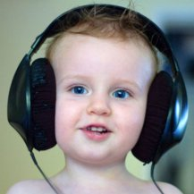

Effortless English + Tài liệu – Phương pháp học Tiếng Anh hiệu quả nhất?

Đây là bài viết có mục đích: Phân tích công dụng và cách học Effortless English
kèm theo đó là các tài liệu cần thiết – cho nên bài này dễ hiểu.

Bao nhiêu là đủ?
----------------

Trước khi học có lẽ chúng ta nên bỏ chút thời gian để xem xét về vấn đề này:
*Một ngày học Tiếng Anh bao nhiêu là đủ?*

Câu trả lời tuỳ thuộc vào điều kiện và hoàn cảnh của mỗi người, thế nhưng thành
công không phải là một kết quả ngẫu nhiên, đó không phải là một sự may rủi như
khi ta chơi một ván bài, mà nó bắt nguồn từ các quy luật, từ cách làm việc khoa
học có thứ tự và nghiêm túc.

– *Thế khoa học ở đây là gì?*

Như bài trước Doremon có nói về Quy luật chuyển hoá lượng chất, đó là thời
gian để “*chất và lượng cũ*” chuyển hoá sang “*chất và lượng mới*” phụ thuộc vào
trình độ của mỗi cấp bậc. Nếu bạn đang ở trình độ thấp thì để lên trình độ cao
thời gian chuyển hoá sẽ ngắn, nhưng từ trình độ cao này để chuyển hoá lên trình
độ cao nữa thì thời gian càng dài. Do vậy hãy quyết định mình muốn lên trình độ
nào thì đầu tư lượng thời gian tương ứng với nó.

Giả sử nếu 1 ngày bạn học 3h, thì kết quả mà bạn đạt được sẽ tương xứng với 3h,
đó là trong giai đoạn đầu bạn sẽ tiến bộ rất nhanh, nhưng sau khi lên đến một
trình độ nào đó (tương ứng với 3h được đầu tư cho mỗi ngày) thì bạn sẽ không bao
giờ tiến lên được nữa. Điều này là do quy luật chuyển hoá lượng chất qui định.

Nếu bạn muốn đun ấm nước thì để nó từ 25 độ C lên 50 độ C ta chỉ cần vài cục
than, dăm ba thanh củi, và khi lên đến 50 độ C thì nhiệt độ sẽ không tăng nữa,
nhiệt độ này tương xứng với nguồn nhiệt (than, củi) mà bạn đã đầu tư.

Do vậy hãy dành thời gian suy nghĩ về vấn đề này, có thể là một ngày, vài ngày
thậm chí là vài tháng. Và nếu thật sự các bạn hiểu về bài viết Repetition ở
trên, thì các bạn sẽ không bao giờ có câu hỏi: vì sao tôi thất bại. Vì bài viết
trên đã trả lời về vấn đề này. Muốn trở thành Master thì có cái giá của nó, và
cái giá này cao hơn nhiều so với cái giá của trình độ bình thường. Vậy mỗi ngày
nên học bao nhiêu là đủ?

Doremon đề nghị các bạn: mỗi ngày nên học ít nhất là 6h. Thế nhưng ở đây lại
nảy sinh vấn đề khác: tôi không đủ thời gian, tôi có công việc…. Rất nhiều lí
do, nhưng các lí do này hoàn toàn không có cơ sở để tồn tại nếu bạn chịu đặt câu
hỏi: thời gian mà tôi đầu tư cho các lĩnh vực khác có giá trị hơn thời gian tôi
đầu tư cho Tiếng Anh? Và Doremon sẽ nêu lên một vài giá trị để các bạn tự so
sánh.

Mỗi người chỉ có một cuộc đời duy nhất, các bạn có muốn suốt cuộc đời mấy chục
năm này ta quanh đi quẩn lại vẫn và “*cái xó*”. Và các bạn có biết đây là thời
đại của kỹ thuật số, của sự phát triển và thay đổi đến chóng mặt, cho nên đừng
vì sự thiếu hiểu biết mà chỉ đặt câu hỏi: Ta nên làm nghề gì? Câu hỏi này được
hình thành do kết quả của sự trì trệ về tri thức ở nơi mà ta đang sống. “*Con
muốn làm nghề gì?*” “*Em muốn làm nghề gì?*” “*Mày muốn học cái gì?*”…

Và những con người này luôn cho rằng: họ chỉ làm mỗi một nghề cho tới khi chết.
Và đây là câu hỏi cực kì giá trị của những chuyên gia dự báo về tương lai, của
những con người có bộ óc sắc bén và tầm nhìn vượt lên trên đám đông, đó là: *Ta
nên làm nghề gì đầu tiên?*

Ta nên làm nghề gì đầu tiên? Vâng, có nghĩa là để sinh tồn thì ta bắt buộc phải
làm tới cái nghề thứ 2 và thứ 3, …. Khi thế giới đã chuyển mình qua thời đại kỹ
thuật số, thì không có cái nghề nào là bền vững và cố định. Cho nên nếu bạn
không muốn bị xã hội đào thải thì hãy thuận theo tự nhiên – Đạo Lão–Trang, xã
hội đi đến đâu ta sẽ theo đến đó.

Rất có thể bạn chưa đủ tầm nhìn để thấy được điều này, nhưng hãy cứ dùng bản
thân của mình để trải nghiệm, sẽ tới một lúc nào đó mà cái nghề bạn đang học,
công việc bạn đang làm, “*cái ghế*” bạn đang ngồi sẽ không một công ty nào cần
nữa. Lúc này số phận bạn sẽ như thế nào? Bạn sẽ bị đào thải, có nghĩa là bị thất
nghiệp và phải chấp nhận con đường làm công nhân để kiếm sống, vì tri thức mà
bạn được học đã không còn hợp với thời đại nữa.

Cho nên để đảm bảo ta không bị đào thải, thì ta phải có “*cái thứ*” mà xã hội
luôn luôn cần. “*Cái thứ*” này là khả năng học tập tri thức mới. Và công cụ để
đạt được mục đích trên là: Tiếng Anh – vì sao thì chúng ta nên tự nghiền ngẫm.
Chỉ cần bạn sở hữu Tiếng Anh thì cũng đủ để bạn sinh tồn mà không cần bất cứ một
tri thức chuyên ngành nào, bạn sẽ tin nếu bạn chịu lật các mục việc làm đang in
đầy trên báo.

Nhưng chúng chỉ là sự thật khi bạn đạt đến trình độ Master. Vấn đề này muốn viết
thì còn dài lắm.

Khi bạn đã đạt đến một trình độ nào đó về Tiếng Anh thì lúc này bạn sẽ không còn
“*học*” nữa, vì đây là lúc bạn ứng dụng nó vào cuộc sống, bạn đọc sách Tiếng
Anh, bạn xem phim Tiếng Anh, …. Cho nên trong giai đoạn đầu, bạn phải hi sinh
thời gian ở các hoạt động khác cho môn này, và đây là giai đoạn khó khăn nhất.

Effortless English
------------------

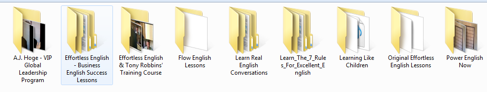

Nhìn vào ảnh ta thấy nó gồm nhiều phần, và phần mà các bạn nên học là **Power
English Now**, vì:

1.  Các phần khác chỉ là “*bản nháp*” của phần trên.

2.  Là phần mở rộng.

3.  Chưa đầu tư nhiều.

Trong Power English gồm 30 bài, mỗi bài có nội dung như ảnh:

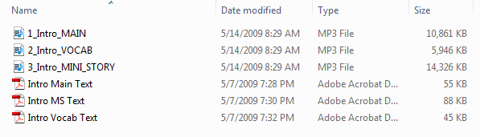

Riêng từ bài 9 trở lên, có thêm *POV text*:

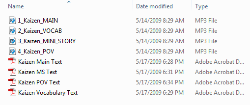

Và dưới đây là nội dung của từng phần:

### Main text

Đây là phần AJ Hoge trình bày về các bài viết có liên quan đến phương pháp học,
hay cách sống của ông ta để làm khơi dậy ước mơ người học – quan trọng: đây là
bài viết có ý nghĩa.

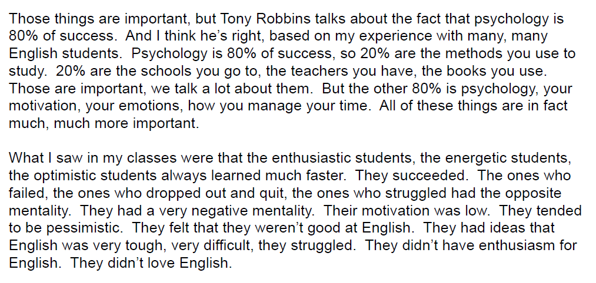

### Vocab text

Phần này AJ Hoge giải thích ý nghĩa của các từ vựng mà ông ta cho là khó hiểu
trong bài Main text – đây là phần vô nghĩa, tức là nó không có ý nghĩa gì hết,
chỉ là để giải thích từ A có nghĩa là gì, …

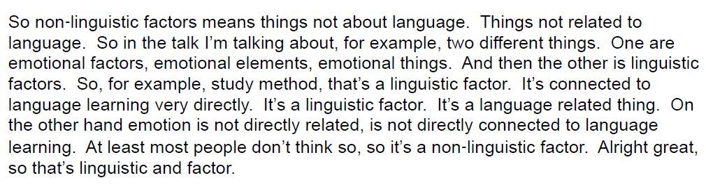

### MS text

Đây là phần quan trọng nhất và dựa theo hiểu biết của Doremon thì trên thế
giới chưa hề có một tài liệu nào như thế này. Đây là nơi mà AJ Hoge đã cố tình
thiết để để ta học ngữ pháp một cách tự nhiên mà không cần đến bất cứ một cuốn
sách ngữ pháp nào.

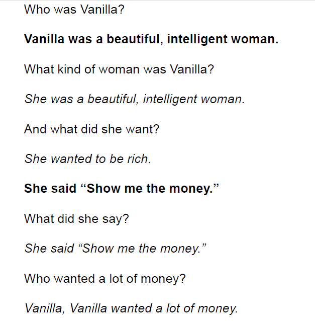

Nhìn vào ảnh ta thấy:

1.  Bài MS text là một câu chuyện có ý nghĩa.

2.  Toàn là câu ngắn, dễ hiểu.

3.  AJ Hoge cố tình sử dụng các từ vựng được cho là khó hiểu trong bài Main, và
    được diễn tả lại trong Vocab text để tạo nên câu chuyện – mục đích là
    repetition – cái này quan trọng ra sao các bạn đã biết.

4.  Các dạng câu rất cơ bản, và được sử dụng đi sử dụng lại rất rất nhiều lần –
    với mục đích vẫn là repetition.

    Cụ thể trong ảnh AJ Hoge sử dụng câu để diễn tả những việc xảy ra trong quá
    khứ. Các bạn không cần biết cấu trúc câu của thì quá khứ như thế nào, các
    động từ, tính từ… nằm ra làm sao. Mà các bạn chỉ cần hiểu cái câu trong bài
    MS text là được. Và đương nhiên, không phải nghe và nhìn 1 lần là hiểu và
    thuộc mà phải nhiều lần. Tất cả các câu trên đều được dùng lặp đi lặp lại
    rất rất là nhiều lần – 1 bài MS text dài hơn 8 trang pdf. Hơn nữa 30 bài MS
    text đều sử dụng cùng loại câu này, cái khác là động từ, là chủ ngữ, …

VD: Bài MS text khác:

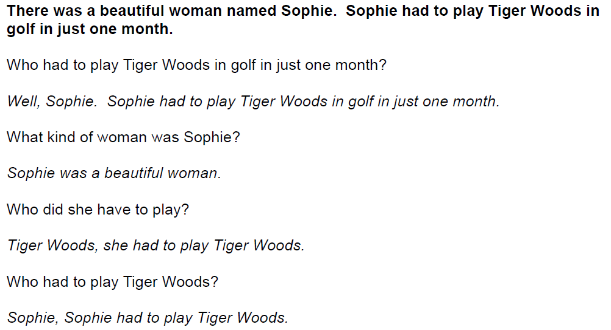

Do vậy ở đây chúng ta thấy rằng: AJ Hoge đã thiết kế ra cái khung, là các dạng
câu để nói về quá khứ mà người Anh–Mỹ dùng. Cho nên các bạn phải sử dụng tốt cái
này: nếu các bạn muốn đạt được trình độ ngữ pháp mà không học ngữ pháp thì các
bạn phải nghe đi nghe lại MS text rất rất nhiều lần.

Khi lặp đi lặp lại đã đủ nhiều thì như Phân Tâm học chúng sẽ được lưu trữ ở phần
tiềm thức, và đến 1 lúc nào đó “*lượng và chất cũ*” đã chuyển hoá sang “*lượng
và chất mới*” thì các bạn có thể dùng lại các câu này cho việc nói viết của mình
mà không cần phải “*ý thức*” – tức là thành phản xạ hay bản năng. Điều này các
bạn hãy dùng bản thân mình để kiểm chứng.

Khi từ bài 9 trở lên AJ Hoge thêm vào POV là các câu diễn tả tương lai, diễn tả
ý khác chứ không là quá khứ.

VD:

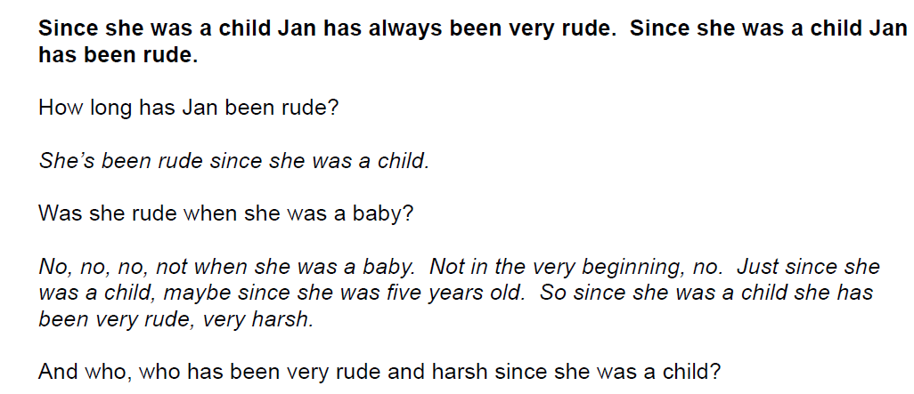

Nhìn vào ảnh ta thấy những câu đó là để diễn tả ý: kể từ khi… A ( B hay C…) đã
làm cái gì…

VD: Since she was a child Jan has always been very rude.

Đương nhiên những cấu trúc câu này cũng được lặp đi lặp rất rất nhiều lần, nên
các bạn sẽ quen. Các bạn không cần biết cấu trúc nó ra sao, vị trí từ… chỉ cần
hiểu cái nghĩa và dùng nhiều thì “*bộ óc*” sẽ tự động sắp xếp sao đó, và ta sẽ
lấy lại mấy câu này để dùng cho ta. Điều này chỉ xảy ra khi và chỉ khi: lặp đi
lặp lại quá nhiều lần – vẫn phải nhắc lại điều này.

Tương tự cho câu ở tương lai:

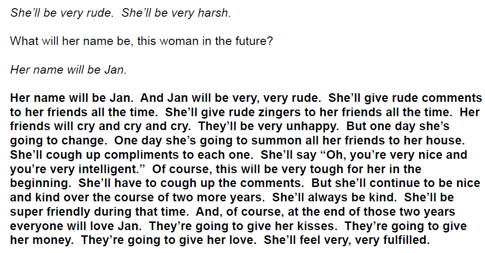

Nhưng việc nghe đi nghe lại vẫn chưa đủ, còn đủ thì như thế nào, Doremon sẽ mô
tả chi tiết sau, đây là giới thiệu sơ lược.

Nên học Effortless như thế nào?
-------------------------------

AJ Hoge có hướng dẫn sử dụng các phần trên, nhưng Doremon dùng nó theo cách
khác. Lí do là AJ Hoge có góc nhìn riêng của ông ta, đó là góc nhìn của một nhà
sư phạm có mấy chục năm kinh nghiệm giảng dạy, một người đã đọc không biết bao
nhiêu công trình Ngôn Ngữ học và là tác giả của Effortless English.

Nhưng Doremon cũng có góc nhìn riêng cuả mình dựa vào các mảng tri thức khác,
và hơn nữa: các bạn chỉ có thể hiểu Effortless English khi mà các bạn đọc bài
Main text cho nên AJ Hoge nói đây là phần đầu tiên phải học, riêng Doremon vì
đã giảng giải cho các bạn ý nghĩa của phương pháp này nên Doremon đề nghị bạn
học MS text trước. Tức là ở đây có sự khác biệt về thứ tự sử dụng bài học giữa
Doremon và AJ Hoge. Vấn đề còn lại: các bạn nên học theo ai? Đây là quyền tự
do lựa chọn của các bạn, các bạn có thể học theo Doremon hay AJ Hoge hay là
theo con đường riêng của mình.

### Phương pháp của AJ Hoge

– AJ Hoge trình bày cách học thứ tự như sau:

1.  Học Main text trước, học đi học lại nhiều lần.

2.  Tới Vocab text, học đi học lại nhiều lần để biết các từ vựng khó trong Main
    text.

3.  Học MS text.

Doremon chỉ trình bày sơ bộ thôi, ai muốn cụ thể thì cứ đọc Main text sẽ rõ.

### Phương pháp của người viết

– Doremon trình bày cách học thứ tự như sau:

1.  Học MS trước, và học hết 30 bài MS (từ bài 1-30: Power English gồm 30 bài).

    Mục đích là cung cấp cho các bạn 1 lượng lớn repetition về các câu ở quá khứ

2.  Học POV, và học hết 22 bài (từ bài 9 trở lên mới có POV).

    Mục đích là cung cấp cho các bạn 1 lượng lớn repetition về các câu ở tương
    lai và hoàn thành.

3.  Học Main text và học hết 30 bài.

4.  Cuối cùng là Vocab text.

– Lí do vì sao Doremon lại xếp như vậy:

1.  Đa phần các bạn trình độ là nhập môn, nên làm sao các bạn có thể hiểu được
    bài Main text gồm 5 trang pdf dày đặc chữ, với các cấu trúc câu phức tạp?
    Nếu muốn hiểu các bạn phải tra từ điển, phải dịch, …, và làm điều này rất
    chán, dễ nản lòng và các bạn cũng chưa đủ khả năng để thực sự hiểu bài Main
    Text.

    Trái ngược lại là bài MS – câu chuyện có ý nghĩa, toàn là câu ngắn, hơn nữa
    từ vựng chỉ vài ba từ lặp đi lặp lại cho tới hơn 8 trang pdf. Cho nên
    Doremon nói học cái này trước vì nó sẽ cung cấp cho bộ não các bạn 1 lượng
    lớn các câu căn bản, lặp đi lặp lại, cho nên nếu học xong thì có gặp lại
    những câu này trong Main text các bạn không cần dịch cũng hiểu.

    Tiếp theo từ vựng ít, nên các bạn có thể “*hốt hết*” từ vựng của MS mà không
    gặp khó khăn gì vì nó cứ lặp đi lặp lại. Toàn những câu căn bản và giống
    nhau về cấu trúc, nên chỉ cần bạn hiểu được 1 câu thì các câu sau tốc độ xử
    lí thông tin sẽ nhanh hơn, và cứ thế cho đến 1 lúc nào đó các bạn sẽ không
    cần dịch mà vẫn hiểu câu đó như thường.

    Vì câu ngắn, gắn liền với câu chuyện của MS, nên nếu các bạn không hiểu câu
    nào thì: chỉ cần dựa vào câu trước nó và câu sau nó thì các bạn cũng phần
    nào đoán ra cái nghĩa của nó mà không cần đến từ điển. Và từ vựng chính
    trong MS là các từ khó trong Main text, nên nếu thuộc hết các từ này thì khi
    đọc Main text các bạn sẽ không còn thấy khó khăn, lúc này ta chỉ quan tâm
    đến nội dung của Main text. Tương tự cho POV.

2.  Sau khi học hết 30 bài MS và 22 bài POV thì các bạn đã có 1 lượng lớn từ
    vựng và cấu trúc căn bản. Cho nên lúc này các bạn có thể học Main text mà
    không khó khăn gì.

3.  Sau khi học hết 30 bài MS, 22 bài POV và 30 bài Main text thì ta sẽ quay lại
    để tiến lên trình độ mới. Lúc này các bạn mới có lí do để học Vocab. Vì
    trong bài Main, MS, POV các bạn sẽ bắt gặp những câu hay từ vựng mà dù các
    bạn có tra từ điển cũng không thể nào hiểu được, đó là các từ quá nhiều
    nghĩa, hay các câu slang…

    Cho nên nếu trong quá trình học MS, POV hay Main mà có câu hay từ nào đó ta
    không hiểu từ cứ kệ nó, đừng cố gắng hiểu mà hãy cứ để nó vào tai và mắt tự
    nhiên. Vocab sẽ giúp ta làm điều này: gọt giũa khả năng hiểu từ, hiểu câu.
    Doremon khuyên dùng nó sau cùng, vì lúc này ta mới có lí do để dùng, nếu
    dùng trước thì rất chán, vì cả đoạn văn dài chả có ý nghĩa gì hết, chỉ giải
    thích từ A có nghĩa…, từ B là…

    Nhưng nếu dùng sau thì lại khác, vì sau khi học đi học lại nhiều lần MS,
    POV, Main mà ta vẫn chưa thực sự hiểu hết cái bài đó thì “*tức*” lắm, lúc
    này muốn hiểu thì Vocab.

Nên học Effortless khi nào?
---------------------------

Như Doremon đã trình bày ở bài số 1, chỉ nên học Effortless English trong 6
tháng hay ít hơn, vì:

1.  Bài nào của Effortless English cũng dài, nên các bạn sẽ ngán liền khi va vào
    nó, vì việc lặp đi lặp lại 1 bài dài hơn 8 trang pdf không phải ai cũng làm
    nổi.

    Doremon muốn các bạn làm quen với English trước đã, và Doremon đã giới
    thiệu *Listening Practice Through Dictation*. Lí do đã trình bày: bài này
    ngắn, 1 bài khoảng 1 phút 30s…, nên việc lặp đi lặp lại cũng dễ dàng hơn
    nhiều.

    Sau khi học hết 4 cấp độ thì lúc này các bạn sẽ cảm thấy dễ dàng hơn với
    việc lặp đi lặp lại 1 bài dài 15 phút

2.  Sau khi học hết *Listening Practice Through Dictation* thì các bạn đã có một
    lượng từ vựng để có thể hiểu dễ dàng MS mà không cần dùng tới từ điển (trừ
    những từ khó như đã nói), lúc này ta chỉ chú tâm vào Distinction – cái này
    nói sau.

3.  Doremon muốn các bạn dùng Effortless tốt hơn nữa. Trong thời gian chuẩn bị
    để học Effortless khoảng 3–6 tháng thì các bạn phải nỗ lực tập phát âm theo
    3 giáo trình đã giới thiệu.

    Hãy học đi học lại 3 cái phát âm này để làm sao đạt đến trình độ là đọc các
    âm cơ bản gần như người bản xứ. Chỉ cần các bạn khổ luyện nói đi nói lại
    nhiều lần thì sẽ thành công. Ai lười học, học qua 1 lần thì hãy nhớ lấy:
    Không repetition thì học lỗ tai bên trái sau đó ra lỗ tai bên phải. Sau đó
    tiến vào MS của Effortless thì sau khi các bạn nghe đã đủ nhiều thì hãy
    pause để đọc lại cái câu đó – tức là lúc này học phát âm, mà là phát âm cả
    câu dài chứ không phải là từ đơn.

    Doremon không muốn các bạn học phát âm bằng từ điển hay phần mềm vì âm rất
    không chính xác, hơn nữa 1 từ đơn đứng 1 mình nó đọc sẽ khác, nếu đứng trong
    1 câu thì đọc sẽ khác. Nếu ai chịu học kỹ 3 giáo trình phát âm thì sẽ thấy
    họ có nói đến điều này. Cho nên MS trong Effortless English sẽ được sử dụng
    như là công cụ để ta học phát âm cả 1 câu, điều này còn có tác dụng
    Repetition – các bạn sẽ nhớ tốt hơn và dùng tốt hơn cái cấu trúc câu đó khi
    đọc nó thành tiếng.

    **Chú ý:** Dù phát âm từ đơn hay 1 câu thì phải càng to càng tốt, thậm chí
    là gào. Điều này AJ Hoge có nói và Lí Dương – tác giả của English Crazy,
    cũng tương tự. Bạn chỉ có thể tự tin cũng như sử dụng tiếng anh một cách tốt
    nhất, nếu bạn đọc nó to lên, cho nên đừng có lí nhí.

Định viết dài cái khúc này mà hết thời gian.

Mối quan hệ tương hỗ
--------------------

– Nghe, đọc (bằng mắt), nói và viết có mối quan hệ sau, Doremon chỉ nêu lên
mối quan hệ dễ thấy:

1.  Việc nói (to thành tiếng) tốt là kết quả của việc tập nói và nghe nhiều. Cho
    nên ai đó có hỏi nên học nghe trước hay nói trước, thì câu trả lời: học song
    song.

2.  Việc nghe tốt là kết quả của việc nói tốt và nghe nhiều.

3.  Việc đọc (bằng mắt) tốt là kết quả của việc nói, nghe, đọc, viết.

4.  Việc viết tốt là kết quả của việc đọc nhiều.

– Vì thời gian có hạn nên Doremon trình bày “*cẩu thả*” như sau, đó là nhớ
đâu, viết đấy:

1.  Effortless English chỉ có tác dụng là cung cấp cái khung ngữ pháp, cho nên
    đừng hỏi tại sao ta học xong mà vẫn không giỏi ngữ pháp, vẫn chưa viết được.
    Nó chỉ là cái khung, là cái nền, và cái nền móng này sẽ giúp ta học cao lên.
    Đó là muốn viết hay, viết giỏi như tiếng Việt tức là viết theo phản xạ, thì
    đó là kết quả của việc đọc nhiều.

    Hãy đọc sách Tiếng Anh nhiều vào, nhưng vẫn nhớ giùm: repetition. Các bạn
    vẫn chưa đủ trình độ để đọc 1 cuốn sách Tiếng Anh 1 lần xong rồi vứt, mà đọc
    xong nó 1 lần, hãy đọc lại nhiều lần, sau đó viết lại cái cuốn sách vừa đọc.
    Hãy nên nhớ để viết được Tiếng Việt thì ta đã viết nát không biết bao nhiêu
    cuốn vở, và nên đọc cuốn sách nào thì Doremon sẽ giới thiệu.

2.  Để tăng khả năng dịch không cần hiểu, thì:

    Các bạn phải đảm bảo có được lượng từ vựng cơ bản, đó là lí do tại sao
    Doremon khuyên nên học hết *Listening Practice Through Dictation*, sau đó
    hạn chế tối đa việc dùng từ điển Anh – Việt.

    Có nghĩa là nếu học xong *Listening Practice Through Dictation*, rồi học
    Effortless English thì chỉ được phép học các giáo trình thoả mãn điều kiện
    sau để đạt được sự tiến bộ nhanh nhất: có audio + pdf + bài văn + có diễn
    giải các từ khó.

    VD:

    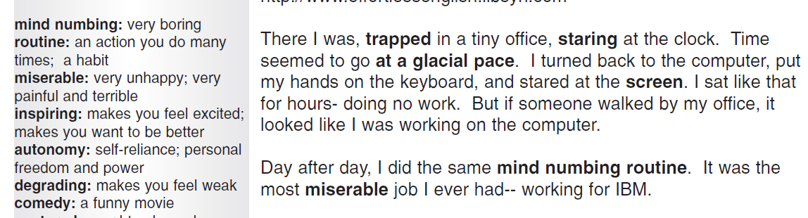

    Tức là luôn có sự giải nghĩa những từ hoặc câu khó bằng Tiếng Anh dựa vào
    các từ cơ bản, như mind numbing = very boring, tức là ta chỉ cần biết nghĩ
    từ boring và very, sau đó ta sẽ biết mind numbing mà không cần dựa vào tiếng
    Việt.

    Chỉ có làm điều này các bạn mới hiểu Tiếng Anh bằng chính Tiếng Anh. Sau đó
    nhờ đọc các sách nhiều mà mới biết khi nào là dùng mind numbing, khi nào
    very boring, giống như từ Việt Nam có rất nhiều từ đồng nghĩa như: ghê gớm,
    đáng sợ, kinh tởm…, và tuỳ vào từng tình huống cụ thể mà ta dùng cho thích
    hợp. Và các tình huống này các bạn chỉ biết được khi các bạn đọc các câu
    truyện Tiếng Anh, đọc nhiều thấy người ta dùng ra sao thì ta bắt chước.

    VD: giáo trình Slang.

    Slang hay idiom mà những câu mà bạn không thể nào hiểu được nếu tra từ điển

    VD:

    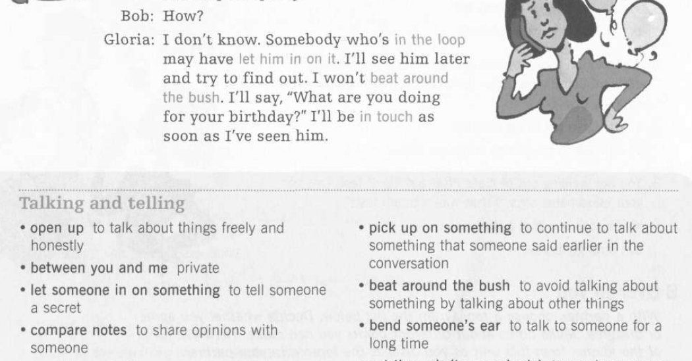

    Nhìn vào ảnh ta thấy cụm “beat around the bush” = …

Các giáo trình
--------------

Doremon tặng các bạn các giáo trình sau, Doremon chỉ giới thiệu tên sách và
các bạn phải tự tìm link. Nếu các bạn có muốn học theo giáo trình nào thì hãy
đảm bảo nó thoả điều kiện: Có audio + pdf + đoạn văn + giải nghĩa. Muốn biết vì
sao thì đọc lại bài viết đầu tiên, và các tài liệu này trên mạng rất nhiều, ai
không tìm được là do lười.

### Các giáo trình về slang

Nhìn vào cái hình cho nhanh:

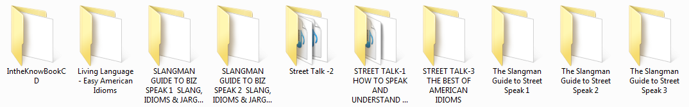

**Chú ý:** Đặc điểm của mấy giáo trình trên là ngắn, cho nên hãy học thuộc, nếu
muốn tiến bộ nhanh. Còn muốn học thuộc thì: nghe nhiều + đọc lại nhiều + viết
lại và tra nghĩa + học thuộc.

### Các giáo trình tập đọc

Đây là link torrent 27 GB, gồm rất nhiều bài đọc thoả mãn: dài khoảng 30 trang,
câu chuyện, trình độ thấp cho tới cao và có audio. Chỉ cần học hết Effortless
English và “*hốt hết*” từ vựng của nó thì đọc mấy cái này vô tư và không cần
dịch:

[<https://kat.cr/english-graded-readers-mega-collection-15-2-2012-t6192183.html>](<https://kat.cr/english-graded-readers-mega-collection-15-2-2012-t6192183.html>)

**Lưu ý:** Chỉ nên nghe mấy giáo trình có audio trước, vì trong đó có cái có cái
không.

Chỉ cần đọc hết đống sách đó nhiều lần là bạn đã đủ khả năng viết vô tư và đọc
các sách cấp cao vô tư. Ráng đọc 6 tháng mà hết là quá giỏi.

### Phim

Tác dụng ra sao thì các bạn đã biết, và nó còn có tác dụng đó là: Nếu lúc nản
hay chán mà vẫn phải đun nước thì phim.

Đây là các bộ phim còn lưu trong máy của Doremon, giới thiệu các bạn, ai muốn
xem gì thì xem. Và xem mình cần coi thể loại nào. Anh em coi thử xem có xxx
trong đó không, do nhiều phim quá, tới gần 2T nên nhiều khi để nhầm :)

1.  Thể loại sôi động: xem cái này có sức sống để thấy yêu đời, muốn “*vận
    động*”.

    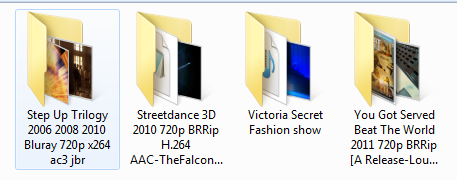

    Chú ý là cái Victoria Secret Fashion show: cái này mấy em chân dài mỏ đỏ.
    Chán đời coi cái này thấy yêu đời lại liền.

2.  Thể loại liên quan đến thảm hoạ:

    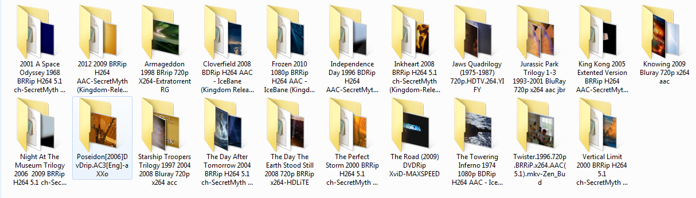

3.  Thể loại kinh dị, cái này anh em cẩn thận, ai yếu tim coi có gì Doremon
    không chịu trách nhiệm.

    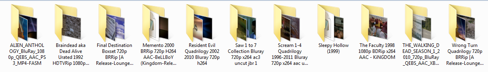

4.  Thể loại lịch sử, thần thoại:

    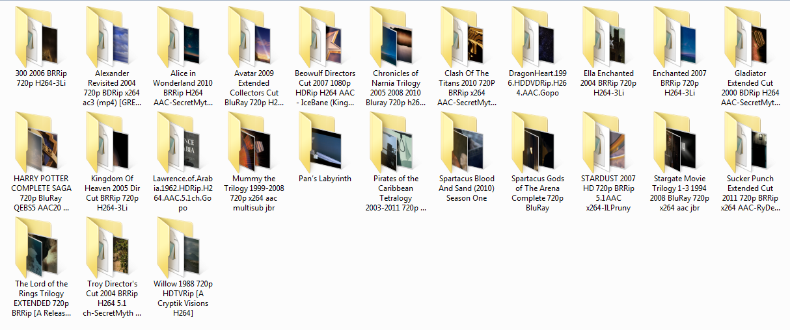

    Chú ý: Hãy để dành phim 300 cho tới khi nào ta chán đời hay mệt mỏi hay chán
    nản thì nó sẽ vực dậy lòng ham sống, ham học trong bạn.

5.  Phim để học Tiếng Anh – đa phần là hài.

    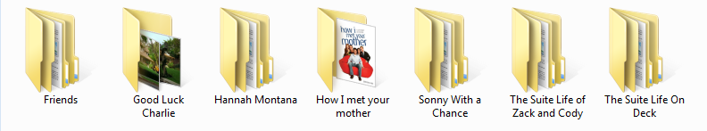

6.  Phim khoa học của BBC – cái này là thuốc bổ đây. Vì ta sẽ biết được thế giới
    là gì, các kì quan thắng cảnh, các chân trời rộng lớn….

    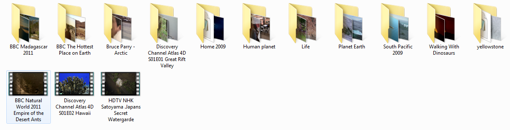

    Chú ý bộ phim HOME.

7.  Các bộ phim có giá trị nhân văn, hay dành cho thiếu nhi hay nhất:

    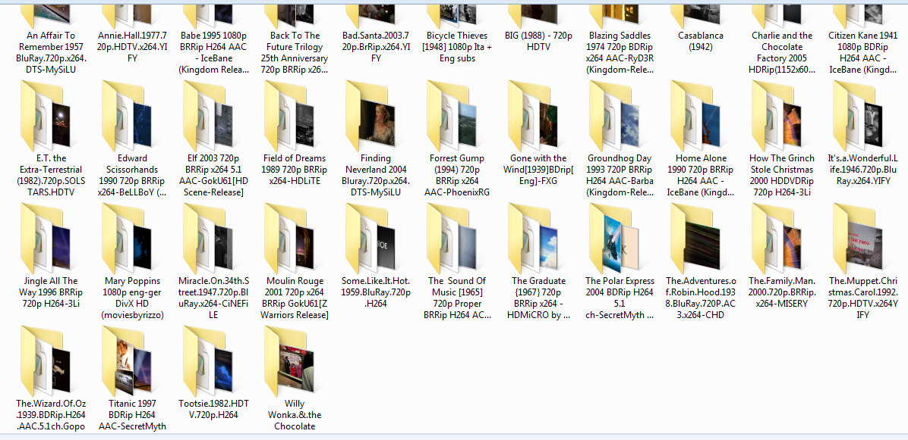

8.  Phim chiến tranh, đấm đá.

    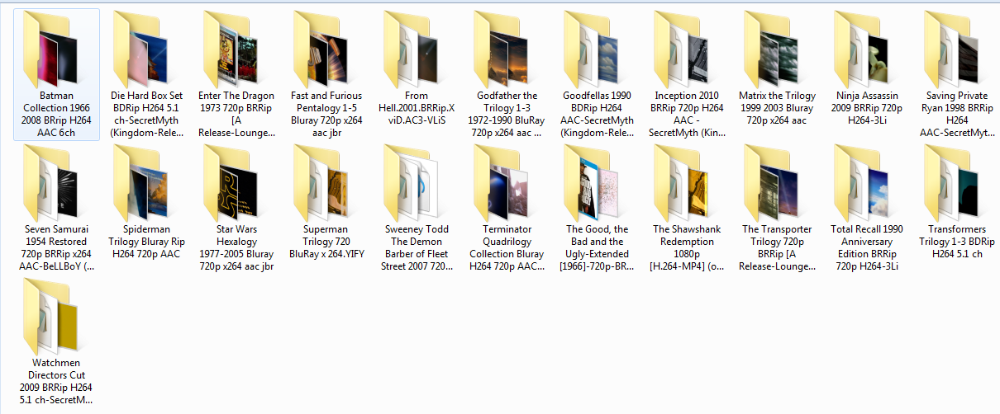

Bây giờ mới nhớ tới Distinction. Hãy nhớ rằng sự phân biệt là kết quả của việc
lặp đi lặp lại quá nhiều lần. Cho nên giai đoạn đầu các bạn cứ lặp đi lặp lại,
sau đó bắt đầu chú ý vào cái câu, cái từ, xem thử chúng giống nhau và khác nhau
ở chỗ nào.

Distinction là giai đoạn cao nhất và cuối cùng, ai làm được điều này thì coi như
là đã tới đích, nhưng nó là kết quả của việc lặp đi lặp lại quá nhiều lần.

Kết luận
--------

Theo phương pháp mà Doremon giới thiệu thì các bạn sẽ không thấy chán, vì
không phải học ngữ pháp, không làm bài test, không chọn đáp án A, B, C, D,…

Mà ta học Tiếng Anh đi vào đời sống, đọc sách tiếng anh có ý nghĩa với ta chứ
không phải mấy bài “*cùi bắp*” trong giáo trình giảng dạy, chán thì coi phim vừa
học vừa giải trí.

### 3 giai đoạn quan trọng

– Và trong này có 3 cột mốc:

1.  Chỉ cần bạn chinh phục được *Listening Practice Through Dictation* thì đã
    khoẻ, vì sao thì đọc lại. Ráng 3-6 tháng là hết.

2.  Sau đó đến Effortless English, ráng phấn đấu thì 3-6 tháng là hết. Sau khi
    hết cái này thì bạn sẽ không còn học Tiếng Anh nữa. Vì lúc này bạn đã đủ
    dùng nó vào cuộc sống, bạn đọc sách thiếu nhi mà Doremon giới thiệu để
    giải trí, xem phim để thư giãn và cải thiện Tiếng Anh.

3.  Đọc 1 lượng sách thiếu nhi khổng lồ, sau đó tăng dần cấp độ.

Hết 3 giai đoạn này bạn dùng Tiếng Anh như người bản xứ vô tư.

### Các lưu ý

– Có 1 vài lưu ý:

1.  Giai đoạn đầu chỉ tập trung nói (phát âm) và nghe.

2.  Nếu có xem phim thì chỉ xem phim Friends vì phim này có tác dụng học nhiều
    hơn là các phim khác, và 1 ngày xem khoảng 1h30s Friend và xem cho hết 10
    season sau đó xem lại…

3.  Repetition sau đó Distinction – cái này nhắc liên tục, nếu ai đó mà quên thì
    thua. Các bạn chỉ đủ khả năng đọc sách, hay nghe bài nào đó 1 lần rồi vứt
    khi bạn lên đến trình độ cao.
